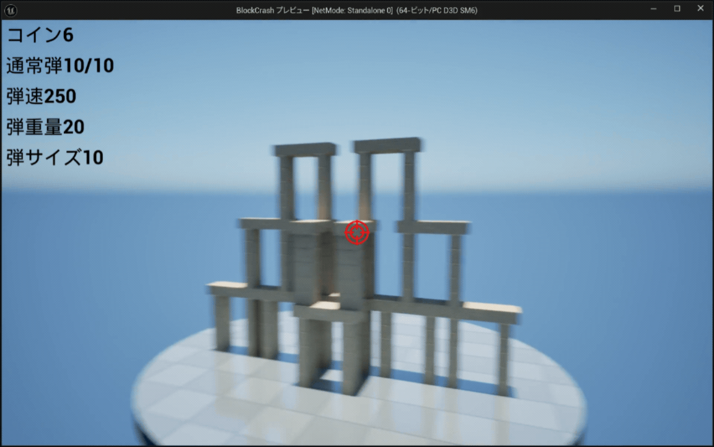

# Block Crash — ポートフォリオ

> 弾を撃って積み重なったブロックを崩す、物理シミュレーション × シューティングゲーム  
> Unreal Engine 5 を用いた個人開発プロジェクト




---

## 目次

1. [ゲーム概要](#ゲーム概要)
2. [技術スタック](#技術スタック)
3. [アーキテクチャ設計](#アーキテクチャ設計)

---

## ゲーム概要

| 項目 | 内容 |
|------|------|
| タイトル | Block Crash |
| ジャンル | 物理シミュレーション × シューティング |
| エンジン | Unreal Engine 5.7 |
| 開発形態 | 個人開発 |
| 開発状況 | 開発中 |
| 言語 | Blueprint / C++ / CUDA |

積み重なったブロックに向けて弾を発射し、大規模な連鎖崩壊を引き起こすシューティングゲームです。  
物理演算によるリアルなブロック崩壊と、スキルツリーによる成長要素を組み合わせたゲームプレイが特徴です。

---

## 技術スタック

| 分野 | 使用技術 |
|------|----------|
| ゲームエンジン | Unreal Engine 5.7 |
| 物理エンジン | Chaos Physics |
| GPU物理実装（研究中） | AVBD (Averaging-based Variational Blended Dynamics) / CUDA / cuBLAS / cuSOLVER |
| VFX | Niagara Particle System |
| UI | UMG (Unreal Motion Graphics) |
| 実装言語 | Blueprint |


---

## アーキテクチャ設計

疎結合・拡張性を重視したシステム設計を採用しています。

```
GameMode
│
├── BP_StageManager      ← ステージ進行・DataTable参照
├── BP_GameRulesManager  ← スコア・ルール管理
├── BP_CoinManager       ← コイン状態の一元管理
└── BP_UIManager         ← UI 表示制御

PlayerPawn
├── BP_FireComponent     ← 発射ロジック（コンポーネント分離）
└── BP_SkillComponent    ← スキル効果の適用

通信インターフェース
├── BPI_GameEvent        ← ゲームイベントの抽象化
├── BPI_ManagerMessage   ← マネージャー間通信
└── BPI_UIMessage        ← UI へのメッセージング

ブロック継承
BP_BlockBase
└── BP_BrickBlockBase
    ├── BP_BrickBlockCube
    ├── BP_BrickBlockHori
    └── BP_BrickBlockVert
```

**設計上のポイント**

- **Manager パターン** : ゲームセッション全体の状態管理を専門マネージャーに分散し、責務を明確化
- **Interface (BPI) パターン** : コンポーネント間をインターフェース経由で通信し、依存関係を最小化
- **データ駆動設計** : ステージ設定・スキルデータを DataTable で外部化し、ゲームデザインの調整をエンジニア不要で行える構造
- **継承による拡張** : ブロックと発射体それぞれに基底クラスを設け、新しいバリエーションを最小コストで追加可能

---


